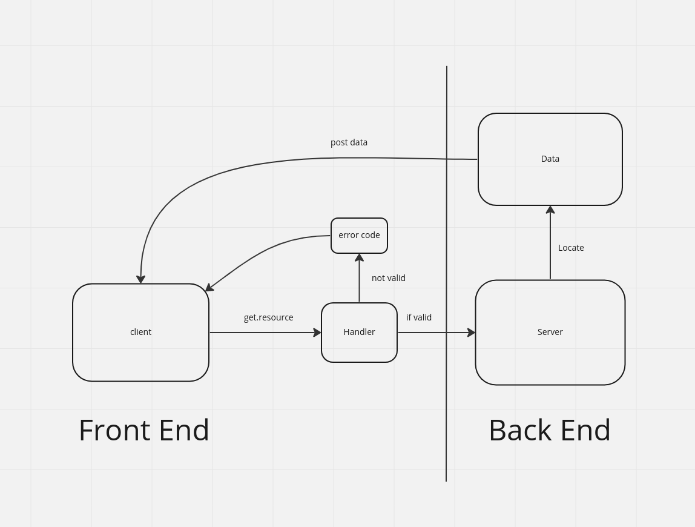
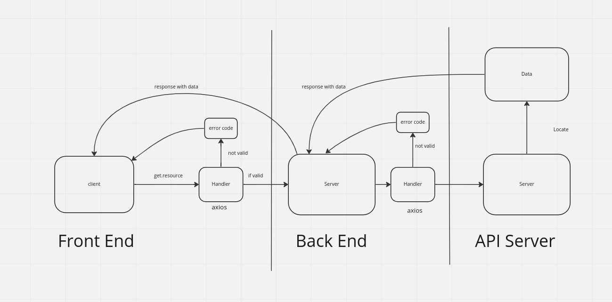
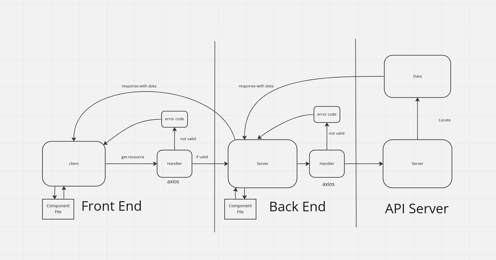

# Project Name

**Author**: Brennan Malone
**Version**: 1.0.5

## Overview

Application is design to reach out to a location API and provide a map interface for the location that is being requested. Created to learn the interworkings of API calls.

## Getting Started

Use React, Axios, and Bootstrap packages. The LocationIQ API key will need to be changed.

## Architecture

LocationIQ, React, HTML, CSS, JavaScript

## Change Log

01-17-2023 3:45am - Application now has a function API call, map rendering and spacing via bootstrap.

01-17-2023 3:45am - Application now has a function API call, map rendering and spacing via bootstrap.

01-18-2023 6:00pm - Completed lab 7 and rendered weather day to page

01-18-2023 7:35pm - Added movie API functionality

## Credit and Collaborations

## WRCC

### Day two

### Day three

## Day four 

## Day Five

------------------------------------------------------------------------------------------------------------------

Name of feature: Setup React Repository and API keys.

Estimate of time needed to complete: 30min

Start time: 12:00am

Finish time: 12:30am

Actual time needed to complete: 30mins

------------------------------------------------------------------------------------------------------------------

Name of feature: Locations seeing lat and lon of locations

Estimate of time needed to complete: 45min

Start time: 12:30am

Finish time: 1:30am

Actual time needed to complete: 60mins

------------------------------------------------------------------------------------------------------------------

Name of feature: Map render

Estimate of time needed to complete: 45min

Start time: 1:30am

Finish time: 2:30am

Actual time needed to complete: 60mins

------------------------------------------------------------------------------------------------------------;

Name of feature: render weather with Weather.js

Estimate of time needed to complete: 1hrs

Start time: 5:00pm

Finish time: 6:00pm

Actual time needed to complete: 1hrs

------------------------------------------------------------------------------------------------------------;

Name of feature: create API callout to movie API

Estimate of time needed to complete: 1hrs

Start time: 6:00pm

Finish time: 7:30pm

Actual time needed to complete: 1hrs

------------------------------------------------------------------------------------------------------------;

Name of feature: created components for each process

Estimate of time needed to complete: 30mins

Start time: 6:00pm

Finish time: 7:30pm

Actual time needed to complete: 1:30 hr
